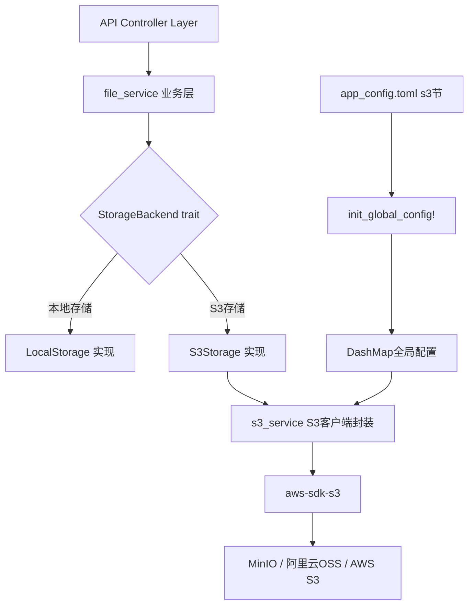

## 产品概述

为现有Rust IM应用创建兼容S3协议的对象存储文件服务，支持MinIO、阿里云OSS、AWS S3等多种S3兼容存储后端，默认使用MinIO。

## 核心功能

- **S3客户端封装**：基于aws-sdk-s3，通过自定义endpoint兼容MinIO/阿里云OSS/AWS S3，配置驱动切换
- **基础文件操作**：上传（单文件+流式）、下载（含Range分段）、删除（单个+批量）、列举（前缀过滤+分页）、复制/移动
- **高级特性**：预签名URL（上传/下载）、大文件分片上传、存储桶管理（创建/删除/列举）、对象元数据管理、CORS配置、生命周期规则
- **存储后端抽象**：定义StorageBackend trait，统一本地存储与S3存储接口，配置开关切换
- **与现有文件服务整合**：复用FileUploadRecord的is_oss/oss_type字段，上传下载流程透明支持S3
- **配置管理**：S3配置写在config/app_config.toml的[s3]节中，通过现有DashMap全局配置体系读取

## Tech Stack

- **S3 SDK**: aws-sdk-s3 + aws-config（官方AWS SDK，通过自定义endpoint支持所有S3兼容存储）
- **HTTP框架**: actix-web（复用现有）
- **配置管理**: toml + DashMap全局配置（复用现有entity/config_manager + read_global_config!宏）
- **异步运行时**: tokio（复用现有）

## Implementation Approach

采用**策略模式**抽象存储后端，新建`s3_service` workspace成员作为独立S3操作层，通过`StorageBackend` trait统一本地与S3存储接口。现有文件服务（file_service）在存储环节委托给StorageBackend实现，根据配置自动选择本地或S3后端，上层业务逻辑无需感知存储差异。S3客户端通过aws-sdk-s3创建，配置自定义endpoint_url和force_path_style实现MinIO/阿里云OSS兼容。

**关键设计决策**：

- 选择`aws-sdk-s3`而非`rust-s3`：官方SDK功能最完整、支持所有S3特性（预签名、分片、生命周期等）、长期维护有保障，代价是依赖较重但可接受
- 新建独立`s3_service` crate而非修改`http_service`：遵循项目现有的服务分crate架构（类似email_service），职责清晰、依赖隔离
- StorageBackend trait定义在s3_service中：集中管理存储抽象，http_service通过依赖s3_service获取

## Implementation Notes

- aws-sdk-s3的S3Client需在tokio运行时中初始化，在`api/src/init_server.rs`中启动时创建并通过`web::Data`注入
- MinIO必须设置`force_path_style = true`，阿里云OSS需设置对应region，AWS S3使用virtual-hosted style
- 分片上传阈值建议100MB，分片大小10MB，并发数10，避免内存溢出
- 预签名URL生成不经过服务端代理下载，直接由客户端访问S3，减轻服务端带宽压力
- 现有FileUploadRecord.file_path字段在S3模式下存储S3 object key，is_oss=1标记为S3存储
- 保持向后兼容：S3 enabled=false时走原有本地存储逻辑，不影响已有功能

## Architecture Design



## Directory Structure

```
project-root/
├── Cargo.toml                              # [MODIFY] 添加s3_service到workspace members和dependencies
├── config/
│   └── app_config.toml                     # [MODIFY] 新增[s3]配置节
├── s3_service/                             # [NEW] S3文件服务crate
│   ├── Cargo.toml                          # [NEW] s3_service依赖声明(aws-sdk-s3, aws-config等)
│   └── src/
│       ├── lib.rs                          # [NEW] 模块导出和公共接口
│       ├── config.rs                       # [NEW] S3配置结构体S3Config，从全局配置读取并初始化S3Client
│       ├── error.rs                        # [NEW] S3统一错误类型S3Error，实现From<aws-sdk-s3错误>
│       ├── client.rs                       # [NEW] S3Client封装，持有aws_sdk_s3::Client，提供工厂方法
│       ├── storage.rs                      # [NEW] StorageBackend trait定义，LocalStorage/S3Storage实现
│       └── operations/
│           ├── mod.rs                      # [NEW] 操作模块导出
│           ├── upload.rs                   # [NEW] 上传操作：put_object + 分片上传(create_multipart/upload_part/complete)
│           ├── download.rs                 # [NEW] 下载操作：get_object + Range下载
│           ├── delete.rs                   # [NEW] 删除操作：delete_object + 批量delete_objects
│           ├── list.rs                     # [NEW] 列举操作：list_objects_v2，前缀过滤+分页
│           ├── copy_move.rs               # [NEW] 复制(copy_object)/移动(copy+delete)
│           ├── presigned.rs               # [NEW] 预签名URL：presign_request生成上传/下载URL
│           ├── bucket.rs                  # [NEW] 存储桶管理：create/delete/list bucket
│           └── metadata.rs               # [NEW] 元数据操作：head_object获取元信息
├── http_service/
│   ├── Cargo.toml                          # [MODIFY] 添加s3_service依赖
│   └── src/
│       └── http_service/
│           └── file_service/
│               ├── mod.rs                  # [MODIFY] 新增s3相关路由初始化
│               ├── controller/
│               │   ├── file_controller.rs  # [MODIFY] 添加S3相关API端点(预签名URL/桶管理等)
│               │   └── s3_controller.rs    # [NEW] S3专用控制器：预签名URL、桶管理、批量操作
│               └── service/
│                   ├── file_service.rs     # [MODIFY] 上传/下载方法支持StorageBackend，根据is_oss分流
│                   └── s3_file_service.rs  # [NEW] S3文件业务服务：S3上传包装、S3下载代理
├── api/
│   ├── Cargo.toml                          # [MODIFY] 添加s3_service依赖
│   └── src/
│       └── init_server.rs                 # [MODIFY] 启动时初始化S3Client并注入web::Data
└── entity/
    └── src/
        └── config_str.rs                  # [MODIFY] 添加S3相关常量(默认桶名、provider枚举值等)
```

## Key Code Structures

```rust
// s3_service/src/storage.rs - 存储后端抽象trait
#[async_trait]
pub trait StorageBackend: Send + Sync {
    async fn upload(&self, key: &str, data: Vec<u8>, content_type: Option<&str>) -> Result<StorageInfo, StorageError>;
    async fn upload_stream(&self, key: &str, stream: impl Stream<Item = Result<Bytes>>, size: i64, content_type: Option<&str>) -> Result<StorageInfo, StorageError>;
    async fn download(&self, key: &str) -> Result<Vec<u8>, StorageError>;
    async fn download_range(&self, key: &str, start: i64, end: i64) -> Result<Vec<u8>, StorageError>;
    async fn delete(&self, key: &str) -> Result<(), StorageError>;
    async fn delete_batch(&self, keys: &[&str]) -> Result<Vec<String>, StorageError>;
    async fn list(&self, prefix: Option<&str>, max_keys: Option<i32>) -> Result<Vec<ObjectInfo>, StorageError>;
    async fn copy(&self, src: &str, dst: &str) -> Result<(), StorageError>;
    async fn move_object(&self, src: &str, dst: &str) -> Result<(), StorageError>;
    async fn get_metadata(&self, key: &str) -> Result<ObjectMetadata, StorageError>;
    async fn presigned_url(&self, key: &str, expires: Duration, method: PresignedMethod) -> Result<String, StorageError>;
    fn storage_type(&self) -> StorageType;
}

// s3_service/src/config.rs - S3配置
pub struct S3Config {
    pub provider: S3Provider,       // MinIO / Aliyun / Aws
    pub endpoint_url: String,
    pub access_key_id: String,
    pub secret_access_key: String,
    pub region: String,
    pub default_bucket: String,
    pub force_path_style: bool,
    pub presigned_url_expiry: u64,
    pub multipart_threshold: i64,
    pub multipart_chunk_size: i64,
    pub max_concurrent_uploads: usize,
    pub enabled: bool,
}
```

## SubAgent

- **code-explorer**: 用于在实现阶段探索现有文件服务的完整调用链和数据流，确保S3集成不遗漏任何依赖点